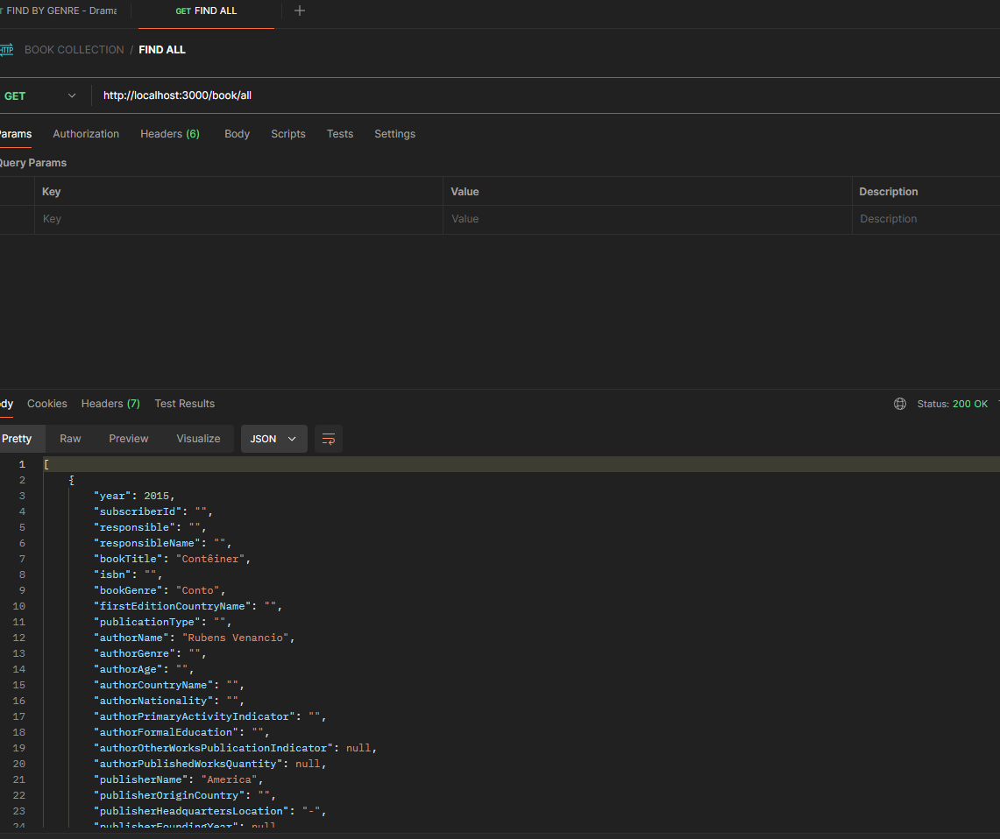

# Project to learn Nestjs and Kong Api Gateway.

## 🛠 Stack.

<ol>
  <li>Node</li>
  <li>Npm</li>
  <li>NestJS</li>
  <li>Jest</li>
  <li>Swagger</li>
  <li>Postman</li>
  <li>Mysql</li>
  <li>Dbeaver</li>
  <li>Docker</li>  
  <li>Kong Api gateway</li>
</ol>

## ⚙️ Architecture General.

## ⚙️ Architecture of API.

## ⚙️ Pull MySQL to Docker.
~~~~shell
docker pull mysql
~~~~

## ⚙️ Create a network in Docker.

~~~~shell
docker network create -d bridge my-bridge-network
~~~~

## ⚙️ Create a container in Docker.

~~~~shell
docker run  -p 3306:3306 --network=my-bridge-network --hostname base-mysql --name base-mysql -e MYSQL_ROOT_PASSWORD=123456 -d mysql:latest
~~~~

## ⚙️ Creating a Database on MySQL.

~~~~sql
CREATE DATABASE `db_labs_systems`;
~~~~

## ⚙️ Creating a Table on Database.

~~~~sql
CREATE TABLE IF NOT EXISTS tb_livros_oceanos_mapeados (
  	id INTEGER PRIMARY KEY AUTO_INCREMENT NOT NULL,
	ano INTEGER NULL,
	id_inscrito VARCHAR(250) NULL,
	responsavel VARCHAR(250) NULL,	
	nome_responsavel VARCHAR(250) NULL,	
	titulo_livro VARCHAR(250) NULL,	
	isbn VARCHAR(250) NULL,	
	genero_livro VARCHAR(250) NULL,	
	nome_pais_primeira_edicao VARCHAR(250) NULL,	
	tipo_publicacao VARCHAR(250) NULL,	
	autor_nome VARCHAR(250) NULL,	
	autor_genero VARCHAR(250) NULL,	
	autor_idade VARCHAR(250) NULL,	
	autor_nome_pais VARCHAR(250) NULL,	
	autor_nacionalidade VARCHAR(250) NULL,	
	autor_indicador_atividade_economica_principal VARCHAR(250) NULL,	
	autor_educacao_formal VARCHAR(250) NULL,	
	autor_indicador_publicacao_outras_obras BOOLEAN NULL,	
	autor_quantidade_obras_publicadas INTEGER NULL,	
	editora_nome VARCHAR(250) NULL,	
	editora_pais_origem VARCHAR(250) NULL,	
	editora_local_sede VARCHAR(250) NULL,	
	editora_ano_criacao INTEGER NULL,	
	editora_linha_predominante VARCHAR(250) NULL,	
	editora_canal_distribuicao VARCHAR(250) NULL,	
	editora_tiragem_edicao VARCHAR(250) NULL,	
	editora_financiamento_edicao VARCHAR(250) NULL,	
	editora_grupo_financiamento VARCHAR(250) NULL,	
	editora_site VARCHAR(250) NULL,
	indicador_outras_edicoes VARCHAR(250) NULL,	
	outras_edicoes_nome_editora VARCHAR(250) NULL,	
	outras_edicoes_ano_publicacao FLOAT NULL,		
	outras_edicoes_nome_pais VARCHAR(250) NULL,
	indicador_semifinalista VARCHAR(250) NULL,	
	indicador_finalista VARCHAR(250) NULL,	
	indicador_vencedor VARCHAR(250) NULL
) 
~~~~

## ⚙️ Load the csv in Database with the DBeaver.

## ⚙️ Execute the command bellow to download of dependencies.

source: [https://github.com/ciceroednilson/project-book-nestjs-kong-api-gateway/tree/master/source/project-book](https://github.com/ciceroednilson/project-book-nestjs-kong-api-gateway/tree/master/source/project-book)

~~~~shell
npm install
~~~~

## ⚙️ Execute the command bellow at root folder to execute the unit tests with jest.

~~~~shell
npm test
~~~~

## ⚙️ Execute the command bellow at root folder to start the API.

~~~~shell
npm start
~~~~

## ⚙️ Open your browser and access the address below to view Swagger documentation.

[http://localhost:3000/api](http://localhost:3000/api)

## ⚙️ Test with Postman.

[https://www.postman.com](https://www.postman.com)

## ⚙️ Postman - Find the books by genre "Dramaturgia".

~~~~shell
curl --location 'http://localhost:3000/book/Dramaturgia/genre'
~~~~

## ⚙️ Postman - Find all books.

~~~~shell
curl --location 'http://localhost:3000/book/all'
~~~~

## ⚙️ Postman - Delete a book by id.

~~~~shell
curl --location --request DELETE 'http://localhost:3000/book/2/key'
~~~~

## ⚙️ Dockerizing NestJS application.

~~~~shell
 docker build -f Dockerfile -t img-api-book .
~~~~

## ⚙️ Create a container in Docker with our image..

~~~~shell
docker run  -p 3000:3000 --network=my-bridge-network --hostname api-book --name api-book -d img-api-book:latest
~~~~

