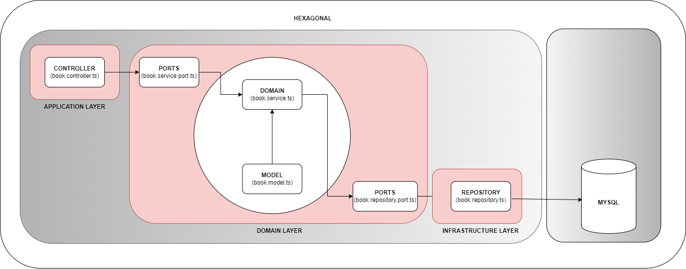
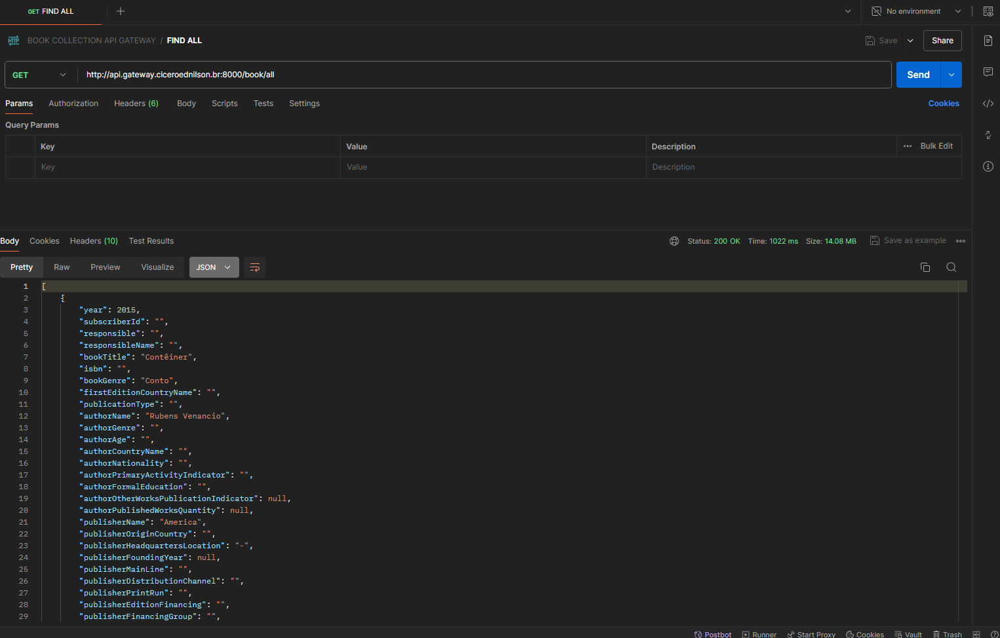

# Project to learn NestJS and Kong API Gateway.

## 🛠 Stack.

<ol>
  <li>Node</li>
  <li>Npm</li>
  <li>NestJS</li>
  <li>Jest</li>
  <li>Swagger</li>
  <li>Postman</li>
  <li>Mysql</li>
  <li>Dbeaver</li>
  <li>Docker</li>  
  <li>Kong Api gateway</li>
</ol>

## ⚙️ General Architecture.

## ⚙️ API Architecture.

## ⚙️ Pull MySQL into Docker.
~~~~shell
docker pull mysql
~~~~

## ⚙️ Create a Docker network for MySQL, Kong API Gateway and the API.

~~~~shell
	docker network create kong-net
~~~~

## ⚙️ Create a MySQL container in Docker.

~~~~shell
docker run  -p 3306:3306 --network=kong-net --hostname base-mysql --name base-mysql -e MYSQL_ROOT_PASSWORD=123456 -d mysql:latest
~~~~

## ⚙️ Creating a Database in MySQL.

~~~~sql
CREATE DATABASE `db_labs_systems`;
~~~~

## ⚙️ Creating a table in a database.

~~~~sql
CREATE TABLE IF NOT EXISTS tb_livros_oceanos_mapeados (
  	id INTEGER PRIMARY KEY AUTO_INCREMENT NOT NULL,
	ano INTEGER NULL,
	id_inscrito VARCHAR(250) NULL,
	responsavel VARCHAR(250) NULL,	
	nome_responsavel VARCHAR(250) NULL,	
	titulo_livro VARCHAR(250) NULL,	
	isbn VARCHAR(250) NULL,	
	genero_livro VARCHAR(250) NULL,	
	nome_pais_primeira_edicao VARCHAR(250) NULL,	
	tipo_publicacao VARCHAR(250) NULL,	
	autor_nome VARCHAR(250) NULL,	
	autor_genero VARCHAR(250) NULL,	
	autor_idade VARCHAR(250) NULL,	
	autor_nome_pais VARCHAR(250) NULL,	
	autor_nacionalidade VARCHAR(250) NULL,	
	autor_indicador_atividade_economica_principal VARCHAR(250) NULL,	
	autor_educacao_formal VARCHAR(250) NULL,	
	autor_indicador_publicacao_outras_obras BOOLEAN NULL,	
	autor_quantidade_obras_publicadas INTEGER NULL,	
	editora_nome VARCHAR(250) NULL,	
	editora_pais_origem VARCHAR(250) NULL,	
	editora_local_sede VARCHAR(250) NULL,	
	editora_ano_criacao INTEGER NULL,	
	editora_linha_predominante VARCHAR(250) NULL,	
	editora_canal_distribuicao VARCHAR(250) NULL,	
	editora_tiragem_edicao VARCHAR(250) NULL,	
	editora_financiamento_edicao VARCHAR(250) NULL,	
	editora_grupo_financiamento VARCHAR(250) NULL,	
	editora_site VARCHAR(250) NULL,
	indicador_outras_edicoes VARCHAR(250) NULL,	
	outras_edicoes_nome_editora VARCHAR(250) NULL,	
	outras_edicoes_ano_publicacao FLOAT NULL,		
	outras_edicoes_nome_pais VARCHAR(250) NULL,
	indicador_semifinalista VARCHAR(250) NULL,	
	indicador_finalista VARCHAR(250) NULL,	
	indicador_vencedor VARCHAR(250) NULL
) 
~~~~

## ⚙️ Load the CSV into the database using DBeaver.

## ⚙️ Execute the command below to download dependencies.

source: [https://github.com/ciceroednilson/project-book-nestjs-kong-api-gateway/tree/master/source/project-book](https://github.com/ciceroednilson/project-book-nestjs-kong-api-gateway/tree/master/source/project-book)

~~~~shell
npm install
~~~~

## ⚙️ Execute the command below in the root folder to run the unit tests with Jest.

~~~~shell
npm test
~~~~

## ⚙️ Execute the command below in the root folder to start the API.

~~~~shell
npm start
~~~~

## ⚙️ Open your browser and access the following address to view Swagger documentation.

[http://localhost:3000/api](http://localhost:3000/api)

## ⚙️ Test using Postman.

[https://www.postman.com](https://www.postman.com)

## ⚙️ Postman - Find books by genre 'Dramaturgia'.

~~~~shell
curl --location 'http://localhost:3000/book/Dramaturgia/genre'
~~~~

## ⚙️ Postman - Retrieve all books.

~~~~shell
curl --location 'http://localhost:3000/book/all'
~~~~

## ⚙️ Postman - Delete a book by ID.

~~~~shell
curl --location --request DELETE 'http://localhost:3000/book/2/key'
~~~~

## ⚙️ Dockerizing a NestJS application.

~~~~shell
 docker build -f Dockerfile -t img-api-book .
~~~~

## ⚙️ Create a Docker container with our custom image.

~~~~shell
docker run  -p 3000:3000 --network=kong-net --hostname api-book --name api-book -d img-api-book:latest
~~~~

## ⚙️ Create a PostgreSQL container in Docker for the Kong database.

~~~~shell
	 docker run -d --name kong-database \
  --network=kong-net \
  -p 5432:5432 \
  -e "POSTGRES_USER=kong" \
  -e "POSTGRES_DB=kong" \
  -e "POSTGRES_PASSWORD=kongpass" \
  postgres:13
~~~~

POSTGRES_USER and POSTGRES_DB: Set these values to kong. This is the default value that Kong Gateway expects.
POSTGRES_PASSWORD: Set the database password to any string. In this example, the Postgres container named kong-database can communicate with any containers on the kong-net network.

## ⚙️ Prepare the Kong database.

~~~~shell
	docker run --rm --network=kong-net \
 -e "KONG_DATABASE=postgres" \
 -e "KONG_PG_HOST=kong-database" \
 -e "KONG_PG_PASSWORD=kongpass" \
 -e "KONG_PASSWORD=test" \
kong/kong-gateway:3.6.1.4 kong migrations bootstrap
~~~~

## ⚙️ Create a Kong container in Docker.

~~~~shell
docker run -d --name kong-gateway \
 --network=kong-net \
 -e "KONG_DATABASE=postgres" \
 -e "KONG_PG_HOST=kong-database" \
 -e "KONG_PG_USER=kong" \
 -e "KONG_PG_PASSWORD=kongpass" \
 -e "KONG_PROXY_ACCESS_LOG=/dev/stdout" \
 -e "KONG_ADMIN_ACCESS_LOG=/dev/stdout" \
 -e "KONG_PROXY_ERROR_LOG=/dev/stderr" \
 -e "KONG_ADMIN_ERROR_LOG=/dev/stderr" \
 -e "KONG_ADMIN_LISTEN=0.0.0.0:8001" \
 -e "KONG_ADMIN_GUI_URL=http://localhost:8002" \
 -e KONG_LICENSE_DATA \
 -p 8000:8000 \
 -p 8443:8443 \
 -p 8001:8001 \
 -p 8444:8444 \
 -p 8002:8002 \
 -p 8445:8445 \
 -p 8003:8003 \
 -p 8004:8004 \
 kong/kong-gateway:3.6.1.4
~~~~

Where:

<ol>
	<li>--name and --network: The name of the container to create, and the Docker network it communicates on.</li>  
	<li>KONG_DATABASE: Specifies the type of database that Kong is using.</li>  
	<li>KONG_PG_HOST: The name of the Postgres Docker container that is communicating over the kong-net network.</li>  
	<li>KONG_PG_USER and KONG_PG_PASSWORD: The Postgres username and password. Kong Gateway needs the login information to store configuration data in the KONG_PG_HOST database.</li>  
	<li>All _LOG parameters: set filepaths for the logs to output to, or use the values in the example to print messages and errors to stdout and stderr.</li>  
	<li>KONG_ADMIN_LISTEN: The port that the Kong Admin API listens on for requests.</li>  
	<li>KONG_ADMIN_GUI_URL: The URL for accessing Kong Manager, preceded by a protocol (for example, http://).</li>  
	<li>KONG_LICENSE_DATA: (Enterprise only) If you have a license file and have saved it as an environment variable, this parameter pulls the license from your environment.</li>  
</ol>

## ⚙️ Open your browser and access the following address to view the Kong Admin.

[http://localhost:8002/](http://localhost:8002/)

## ⚙️ In Kong, you can access the Gateway Services menu and click on 'New Gateway Service'.

## ⚙️ Create a new gateway.

"Attention: In the path, I use the name of my container (api-book)."

## ⚙️ To create a new route, you can access the Routes menu as shown in the image below.

## ⚙️ After configuring your route as shown in the image below, you need to click the 'Save' button.

## ⚙️ After configuring your route, you can add a plugin to capture the logs.

In your route, click on the 'Plugins' menu and then click on '+ New Plugin'.

## ⚙️ "Search for the HTTP Log plugin. Once you have found it, click on 'Enable'.

## ⚙️ You can access the site below to create an address to receive some logs of requests.

[https://mockbin.io](https://mockbin.io)

## ⚙️ You need to copy the address generated to past it into Kong.

## ⚙️ After copying the address, paste it into Kong and save.

## ⚙️ Now execute a request to the route that you created in Kong.

~~~~shell
curl --location 'http://api.gateway.ciceroednilson.br:8000/book/all'
~~~~

## ⚙️ After executing the request, you can view the log on the site.

## ⚙️Now you can configure other routes for our API.

~~~~shell
curl --location 'http://api-book:3000/book/{genre}/genre'
~~~~

~~~~shell
curl --location --request DELETE 'http://api-book:3000/book/{key}/key'
~~~~

## 📌 Version.

1.0

## ✒️ Author.

Cícero Ednilson - ciceroednilson@gmail.com
