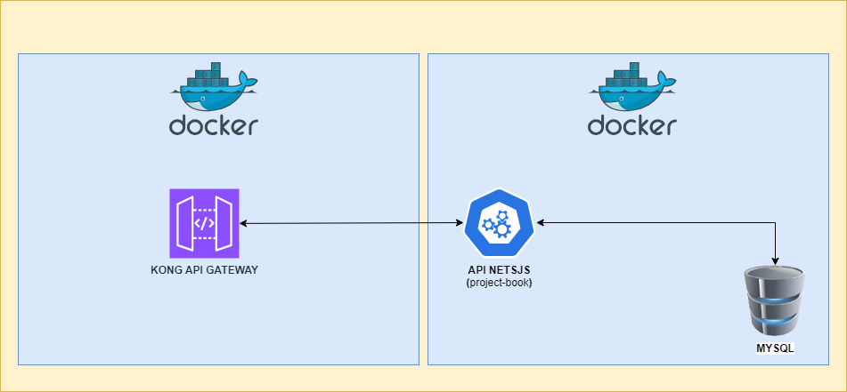

# Project to learn Nestjs and Kong Api Gateway.

## 🛠 Stack.

<ol>
  <li>Node</li>
  <li>Npm</li>
  <li>NestJS</li>
  <li>Jest</li>
  <li>Swagger</li>
  <li>Postman</li>
  <li>Mysql</li>
  <li>Dbeaver</li>
  <li>Docker</li>  
  <li>Kong Api gateway</li>
</ol>

## ⚙️ Architecture General.

## ⚙️ Architecture of API.

## ⚙️ Creating a Database on MySQL.

~~~~sql
CREATE DATABASE `db_labs_systems`;
~~~~

## ⚙️ Creating a Table on Database.

~~~~sql
CREATE TABLE IF NOT EXISTS tb_livros_oceanos_mapeados (
    id                                          INTEGER  PRIMARY KEY AUTO_INCREMENT NOT NULL,
	ano										                		    INTEGER 	 NULL,
	id_inscrito						                				VARCHAR(250) NULL,
	responsavel							                			VARCHAR(250) NULL,	
	nome_responsavel				                			VARCHAR(250) NULL,	
	titulo_livro					                				VARCHAR(250) NULL,	
	isbn										                	    VARCHAR(250) NULL,	
	genero_livro							                		VARCHAR(250) NULL,	
	nome_pais_primeira_edicao		                	VARCHAR(250) NULL,	
	tipo_publicacao								                VARCHAR(250) NULL,	
	autor_nome									                	VARCHAR(250) NULL,	
	autor_genero									                VARCHAR(250) NULL,	
	autor_idade										                VARCHAR(250) NULL,	
	autor_nome_pais								                VARCHAR(250) NULL,	
	autor_nacionalidade						                VARCHAR(250) NULL,	
	autor_indicador_atividade_economica_principal	VARCHAR(250) NULL,	
	autor_educacao_formal							            VARCHAR(250) NULL,	
	autor_indicador_publicacao_outras_obras			  BOOLEAN 	   NULL,	
	autor_quantidade_obras_publicadas				      INTEGER 	   NULL,	
	editora_nome									                VARCHAR(250) NULL,	
	editora_pais_origem								            VARCHAR(250) NULL,	
	editora_local_sede								            VARCHAR(250) NULL,	
	editora_ano_criacao								            INTEGER 	   NULL,	
	editora_linha_predominante						        VARCHAR(250) NULL,	
	editora_canal_distribuicao						        VARCHAR(250) NULL,	
	editora_tiragem_edicao							          VARCHAR(250) NULL,	
	editora_financiamento_edicao					        VARCHAR(250) NULL,	
	editora_grupo_financiamento						        VARCHAR(250) NULL,	
	editora_site									                VARCHAR(250) NULL,
	indicador_outras_edicoes						          VARCHAR(250) NULL,	
	outras_edicoes_nome_editora						        VARCHAR(250) NULL,	
	outras_edicoes_ano_publicacao					        FLOAT 		   NULL,		
	outras_edicoes_nome_pais						          VARCHAR(250) NULL,
	indicador_semifinalista							          VARCHAR(250) NULL,	
	indicador_finalista								            VARCHAR(250) NULL,	
	indicador_vencedor								            VARCHAR(250) NULL
) 
~~~~